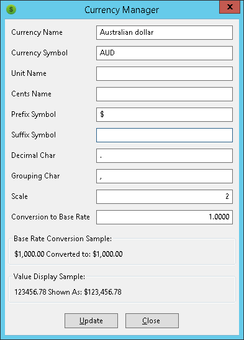

Money Manager EX allows you to simply create a new bank account with a simple wizard.

It currently supports three types of accounts:

- “Checking” Account: This is the most common type of account used for MMEX, and can handle most common account types, such as checking accounts, savings accounts, and credit card accounts. Also known as Bank Account, and supports three kinds of transactions. These are withdrawal, deposit, and transfers.

- “Term” Accounts: similar to Checking Accounts with the exception that they appear in their section on the home page and can be shown or hidden for normal daily usage. For a better explanation see the account setup example. These kinds of accounts cover specialized accounts such as Cash Term Accounts, Bank Mortgage accounts, Loan accounts, or investment accounts with regular income or expenditure that you need to keep track of. These accounts have their balance section on the Home Page. These accounts also support three kinds of transactions.

- "Investment" Account: The other type of account that MMEX supports is an "Investment" Account. This type of account allows you to track stock/bonds/mutual funds investments and possibly other investments you may own.

As it can be used in many countries, MMEX needs to consider the currency for the country of use. When creating a new database, the base currency is set to the currency used in the user's country. 
If the user's currency setting is not listed in the default currencies, the user can create their currency listing. MMEX allows us to work with more than one currency. Each account has its currency setting and will default to the base currency. When we set accounts with different currencies, the transactions we create in these accounts will reflect the currency of the account.

|    |    |
| --- | --- |
|  |  |
|  |  |
|  |  |